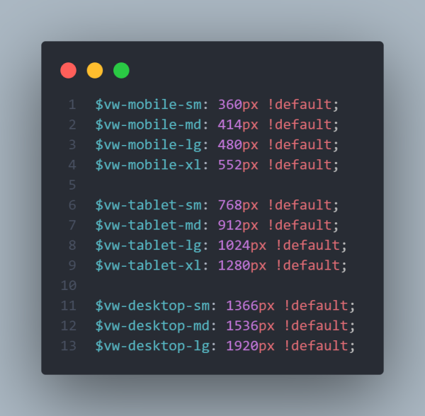

# mixins-sass
The project's name is **LESSIER** which stands for *less* code to make projects *easier* :D.

Here I'll upload useful mixins for SASS (either created by me or others).

The images that I'll upload are illustrative only, they don't show all the properties you can use in the mixins (check out the SASS file to see all the properties that are available in them).

## Table of contents

1. [Grid](#Grid)
    - [Use](#Use)
    - [Preview](#Preview)
2. [Flexbox](#Flexbox)
    - [Use](#Use-1)
    - [Preview](#Preview-1)
3. [Pseudo-element](#Pseudo-elements)
    - [Use](#Use-2)
    - [Preview](#Preview-2)
4. [Support](#Support)
    - [Use](#Use-3)
    - [Preview](#Preview-3)
5. [Shadow](#Shadow)
    - [Use](#Use-4)
    - [Preview](#Preview-4)
6. [Media Queries](#Media-Queries)
    - [Use](#Use-5)
    - [Preview](#Preview-5)
    - [Sizes](#Default-sizes)
7. [Box-model](#Box-model)
    - [Use](#Use-6)
    - [Preview](#Preview-6)

### Grid

> **Note**: Created by [@said_alrove](https://twitter.com/said_alrove) on 14.07.21

#### Use
If you're going to use both properties, **justify** and **align** at the same time, then consider using the shorthand **place** for less code.

If you're going to use both properties, **row-gap** and **column-gap** at the same time, then consider using the shorthand **gap** for less code.

If for any reason you put both properties of a shorthand, each individually, SASS is gonna show you a warn saying that you should be using the shorthand instead (but the code won't stop compilating).

Because sometimes you might use this mixin more than once in the same context, you can tell the mixin to don't print the display declaration again by using the **$display** argument and giving it a false value.

The property **grid-template-areas** is not included here due to in most of the cases you'll write complex layouts, therefore the task of reading the property within the mixin would be difficult if you're not careful.

In the case of the **grid-template-columns** might happen the same if you decide to use the line names within it, thus if you do it, I encourage you to write the property individually, out of the mixin, for more readability.

> Keep your code readable!.

#### Preview

##### SASS


##### CSS


### Flexbox

> **Note**: Created by [@said_alrove](https://twitter.com/said_alrove) on 14.07.21

#### Use
If you use both properties **flex-direction** and **flex-wrap**, SASS will compile it with the shorthand **flex-flow** for less code. 

> In that case, I decided to don't create a specific argument for the shorthand property **flex-flow** due to they're not totally related such as **justify-content** and **align-content** in Grid.

Because sometimes you might use this mixin more than once in the same context, you can tell the mixin to don't print the display declaration again by using the **$display** argument and giving it a false value.

#### Preview

##### SASS


##### CSS


### Pseudo-element

> **Note**: Created by [@said_alrove](https://twitter.com/said_alrove) on 15.07.21

#### Use
I decided to still use the individual properties as arguments due to that way you can be more specific when calling this mixing (thanks to this, you can identify where each value belongs to faster).

> **Inset** has a 81.89% support in 14.07.21, therefore I considered useful to use it here instead of putting each property individually, and that way write less code.

You might use $inset only if you are going to use the inline and block (or the full shorthand) values, for instance: 
```
    inset: 2rem 1rem; 
```
Or:
```    
    inset: 2rem; 
```
Otherwise, if you use $inset to give it the four values individually, will be harder to understand where each value belongs to (top, right, bottom, or left), thus if you have to specify more than 2 values, then you should use the individual arguments instead of using the inset shorthand.

> However, if you use the individual arguments, they'll be compiled to CSS with the **inset** shorthand anyways, the difference is that you'll be able to understand in a better way where a value belongs to when reading the code.

#### Preview

##### SASS


##### CSS


### Support

> **Note**: Created by [@said_alrove](https://twitter.com/said_alrove) on 15.07.21

#### Use
By default, if you don't give any true value to the **support** argument, the mixin will print within the code [the 4 most used prefixes](https://www.thoughtco.com/css-vendor-prefixes-3466867).

Otherwise if you give to the **support** argument a true value, you're able to write your own prefixes.

> In that case, the prefixes that are by default won't be printed ... you'll have to indicate which ones to use on your own.

To write your own prefixes, you should create arguments with prefixes as values, e.g. $chrm: 'webkit', that way the mixin won't print unnecessary prefixes.

> The key name of the argument nevermind, it's needed only because without it it's impossible to parse it with the @each at-rule.

If you write your own prefix without specifying it with the "support" argument (by giving it a true value as I mentioned before), SASS is gonna stop compilating and it'll show you an error.

#### Preview

##### SASS


##### CSS


### Shadow 

> **Note**: Created by [@said_alrove](https://twitter.com/said_alrove) on 16.07.21

#### Use
Using this mixin allows you to be more specific about where a value belongs to (e.g. by specifying the "x" or "y" axis with the names of the arguments).

I didn't find any way how I could give the opportunity to the user of putting more than one shadow (I'll work on that).

> That's something possible in LESS, but I've not found how to do it in SASS yet.

#### Mixin's preview

##### SASS


##### CSS


### Media Queries

> **Note**: Created by [@said_alrove](https://twitter.com/said_alrove) on 16.07.21

#### Use
You can choose among the different default sizes I've already created, or if you want, you can either modify or create your own screen resolutions for the media queries just by changing the value of the keys that are already created, or by creating new ones). You can modify the name of the devices as well or add more.

You can decide what'll be the query's criteria for the breakpoint (min-width, max-width, min-height, or max-height) just by writing the rule in the type's argument (min-width is the default).

If you write a query's unknown criteria, SASS will stop compilating and it's going to show you an error telling you that you're using a wrong $type's value.

> I've nested a map inside the main one for each kind of device to be more specific and then I added the different screen sizes that could fit there with abbreviations like **sm**, **md**, **lg**, and **xl** as key's names, but you can add more devices and screen sizes if you want it.

Each key's value is related to a variable within the SASS file instead of a fixed value, this allows the user to modify a key's variable if he wants without going to the library. The user just has to import LESSIER with the **@use** at-rule and the keyword **with**, that way you can overwrite a variable's value. 

If you'd want to know more about what I'm talking about you can check the [@use](https://sass-lang.com/documentation/at-rules/use) section in the [SASS documentation](https://sass-lang.com/documentation/syntax).

The sizes that are assigned by default are based on the most used screen sizes in the world according to [Statcounter](https://gs.statcounter.com/screen-resolution-stats/desktop/worldwide).

#### Preview

##### SASS


##### CSS


#### Default Sizes



### Box-model 

> **Note**: Created by [@said_alrove](https://twitter.com/said_alrove) on 04.08.21

#### Use
You just have to call this mixin within the html and universal selector and the mixin itself it's going to do the rest.

The mixin automatically detects when it's located within the html or the universal selector and then runs, if it's not located there, it's going to show you an error telling you that you should use this mixin inside the selectors mentioned before.

#### Preview 

##### SASS
-sass.png)

-sass.png)

##### CSS
-css.png)

-css.png)

### Coming soon...
I'll continue uploading more mixins soon ... if you'd like to help me adding more interesting mixins, send me a message on [Twitter](https://twitter.com/said_alrove) :D!.