# mixins-sass
The project name is LESSIER that stands for less code to make projects easier :D.

Here I'll upload useful mixins for SASS (either created by me or others).

The images that I'll upload are illustrative only, they don't show all the properties you can use in the mixins (check out the SASS file to see all the properties that are available in the mixins). There are comments in the SASS file available for you to understand how to use each mixin.

## Table of contents

1.- [Example](#CSS-Grid-Mixin-(14.07.21)

## CSS Grid Mixin (14.07.21), created by [@said-alrove](https://twitter.com/said_alrove).

### Notes
If you're gonna use both properties **justify** and **align** then, use the shorthand property "place" for writing less code.

If for any reason you put both properties each individually, SASS is gonna stop compilating and it'll tell you that you should use the "place" shorthand instead.

### Mixin's preview

#### SASS
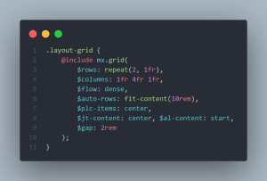

#### CSS

## Flexbox Mixin (14.07.21), created by [@said-alrove](https://twitter.com/said_alrove).

### Notes
If you use both properties "flex-direction" and "flex-wrap", SASS will compile it with the shorthand "flex-flow" for less code.

### Mixin's preview

#### SASS
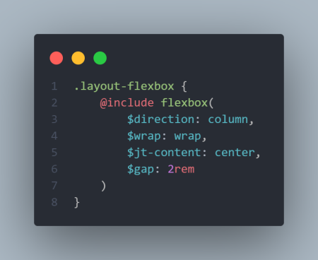

#### CSS
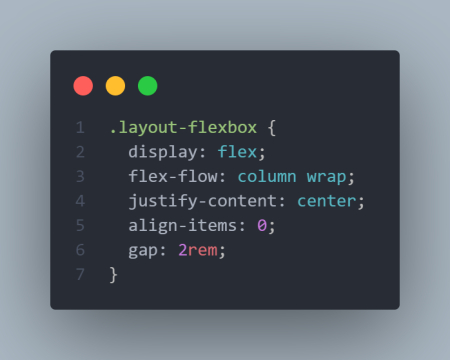

## Pseudo-elements mixin (15.07.21), created by [@said-alrove](https://twitter.com/said_alrove) but inspired in one made by [@kevinjpowell](https://twitter.com/kevinjpowell?lang=en).

### Notes
I decided to still use the individual properties as arguments due to that way you can be more specific when calling this mixing (thanks to this, you can identify faster where each value belongs to).

"Inset" has a 81.89% usage in 14.07.21 so I consider useful to use it here instead of putting each property, and that way write less code.

You might use inset only if you give the properly values, e.g. inset: 1rem; or inset: 1rem 2rem;...if you use $inset to give it the four values individually, will be harder to understand where each value belongs to (top, right, bottom, or left), therefore if you have to specify more than 2 values, then you should use the individual arguments instead of using the inset shorthand.

However, if you use the individual arguments, they'll be printed with the shorthand "inset" anyways, the difference is that you'll be able to understand in a better way where a value belongs to from the SASS file.

By interpolating the location value you can decide if the pseudo-element is either before or after (before is the default).

### Mixin's preview

#### SASS
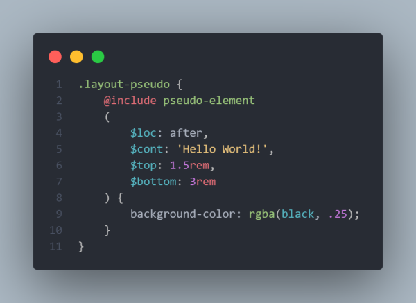

#### CSS
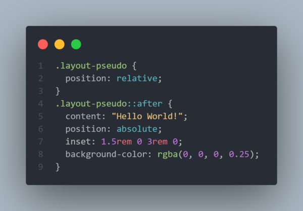

## Support mixin (15.07.21), created by [@said-alrove](https://twitter.com/said_alrove).

### Notes
By default, if you don't give any true value to the "support" argument, the mixin will print within the code the 4 most used prefixes (from my pov).

Otherwise if you give to the "support" argument a true value, you're able to write your own prefixes.

To write your own prefixes, you should create arguments with prefixes as values (e.g. $chrm: 'webkit', the key name of the argument nevermind, it's needed only because without it it's impossible to parse it with @each) that way the mixin won't print unnecessary prefixes.

If you write your own prefix without specifying it with the "support" argument (by giving it a true value as I mentioned before), SASS is gonna stop compilating and it'll show you an error.

### Mixin's preview

#### SASS
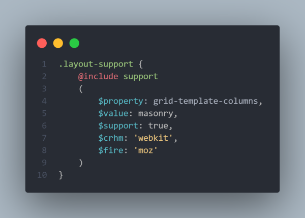

#### CSS
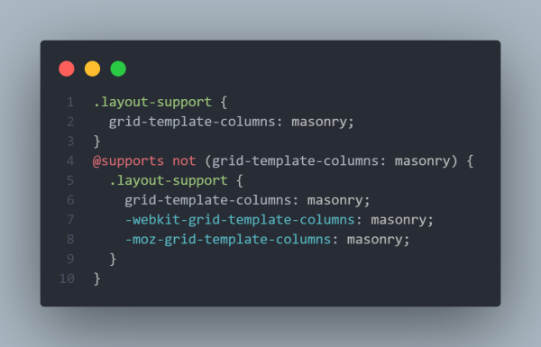

## Shadow mixin (16.07.21), created by [@said-alrove](https://twitter.com/said_alrove).

### Notes
Using this mixin allows you to be more specific about where a value belongs to (e.g. by specifying the "x" or "y" axis with the arguments' names).

I didn't find any way how I could give the opportunity to the user of putting more than one shadow (I'll work on that).

### Mixin's preview

#### SASS
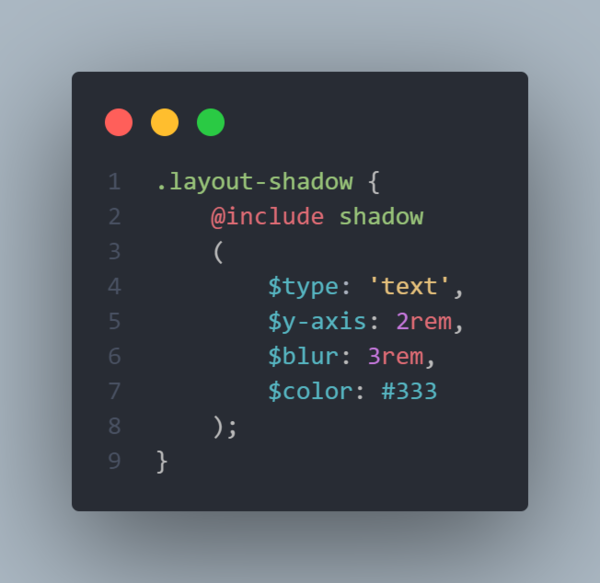

#### CSS
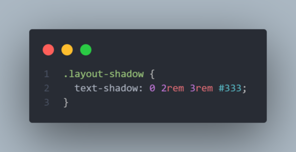

## Media Queries mixin (16.07.21), created by [@said-alrove](https://twitter.com/said_alrove).

### Notes
You can choose among the different default sizes I've already created (or if you want, you can either modify or create your own screen resolutions for the media queries just by changing either the key, the value, or both once you import this stylesheet). You can also modify the keys devices as well.

You can decide what'll be the query's criteria for the breakpoint (min-width, max-width, min-height, or max-height) just by writing the rule in the type's argument (min-width is the default).

I didn't find a way to let the mixin detects when the user puts an unknown value, the mixin only detects when the user doesn't put a value and leave the size variable empty.

I've assigned a key for each kinda device to be more specific and then I added the different screen sizes that could fit there with keywords like "small", "medium", and "big" as keys, but you can add more devices and screen sizes if you want.

### Mixin's preview

#### SASS
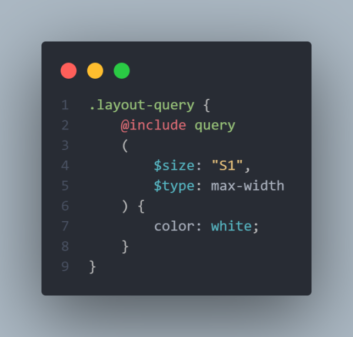

#### CSS
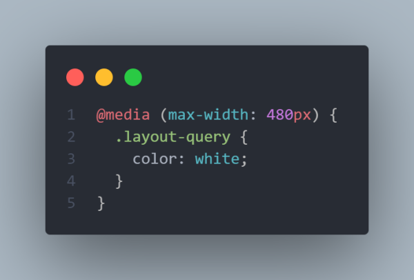

### New feature (06.08.21)

Now each key's value is related to a variable within the SASS file instead of a fixed value, this allows the user to modify a key's variable if he wants without going to the library just by importing it with the rule "@use" and the keyword "with", that way you can overwrite a variable's value locally (this means that the modified variable will be only available in that specific module where you imported it). If you want more descriptive information check the third image below (the variables have the "less-" prefix due to I had already imported them in a SASS main file and I'm used to forwarding the different modules that contain members such as variables, maps, or mixins with prefixes because thanks to that I can have more control over the members' location. But if you import Lessier directly into your module, you just should put the module's name as a prefix, e.g. "theme.$vw-mobile-sm" unless that as me, you specify to don't have a prefix for that module you're importing by doing this "@use '../theme' as *;).

If you'd want to know more about what I'm talking about you can check the [@use](https://sass-lang.com/documentation/at-rules/use) and [@forward](https://sass-lang.com/documentation/at-rules/forward) sections in the [SASS documentation](https://sass-lang.com/documentation/syntax).

**Does that mean that I won't be able to use, for instance, 'sm' as the "$size" value anymore?** Absolutely not, the "$size" variable is related to the keys nested within the maps of the different devices (those maps are also nested within the main map that contains all the information), meanwhile the new variables are related to the values of those keys, therefore you'll still be able to use the keys' names 'sm/md/lg/xl' as the "$size" value.

**Does that mean that I won't be able to customize the sizes manually in the library anymore?** Once again, no, this new feature will only help you to make that process more dynamic without eliminating the possibility of customizing manually those values, therefore ... have fun!.

The sizes that are assigned by default are based on the most used screen sizes in the world according to [Statcounter](https://gs.statcounter.com/screen-resolution-stats/desktop/worldwide).

#### Sizes

.png)

.png)

.png)

## Box-model mixin (04.08.21), created by [@said-alrove](https://twitter.com/said_alrove).

### Notes
You just have to call this mixin within the html and universal selector and the mixin itself it's gonna do the rest.

The mixin automatically detects when it's located within the html or the universal selector and then runs, if it's not located there, it's gonna show you an error telling you that you should use this mixin inside the selectors mentioned before.

### Mixin's preview 

#### SASS
-sass.png)

-sass.png)

#### CSS
-css.png)

-css.png)

## Coming soon...
I'll continue uploading more mixins soon...if you want to help me adding more interesting mixins, send me a message on [Twitter](https://twitter.com/said_alrove) :D!.
