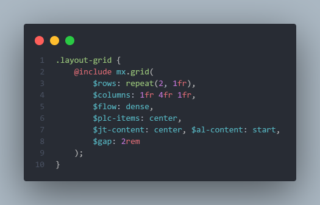
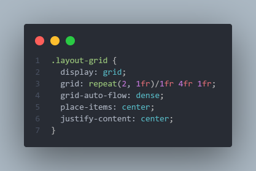
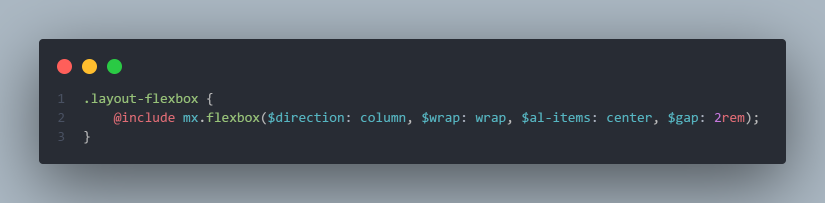
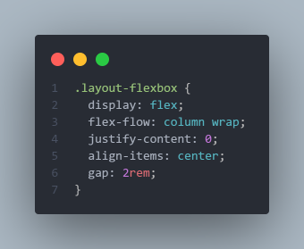

# mixins-SASS
Here I'll upload useful mixins for SASS (either created by me or others).

The images that I'll upload are illustrative only, they don't show all the properties you can use in the mixins (check out the SASS file to see all the properties that are available in the mixins)

## CSS Grid Mixin (14.07.21), created by [@said-alrove](https://twitter.com/said_alrove).

### Mixin's preview

#### SASS

#### CSS

## Flexbox Mixin (14.07.21), created by [@said-alrove](https://twitter.com/said_alrove).

### Mixin's preview

#### SASS

#### CSS

## Coming soon...
I'll continue uploading more mixins soon...if you want to help me adding more interesting mixins, send me a message on [Twitter](https://twitter.com/said_alrove) :D!.
