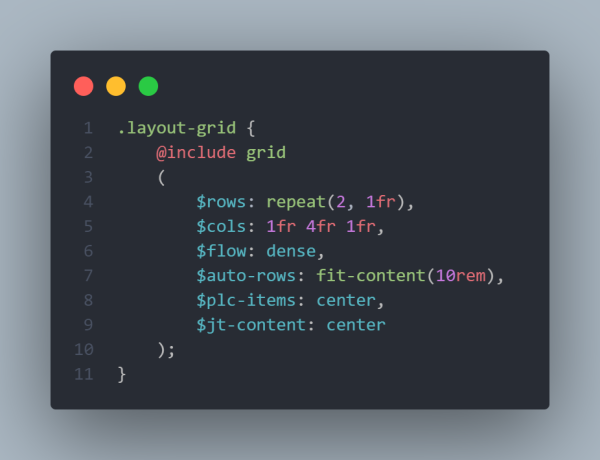
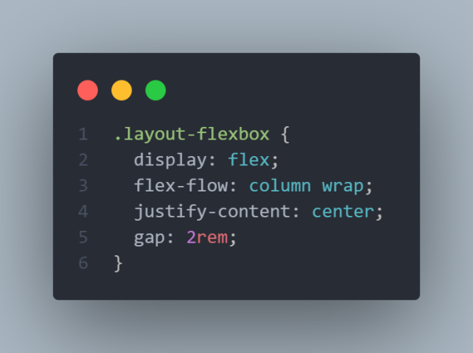
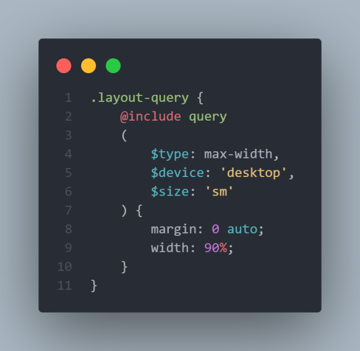
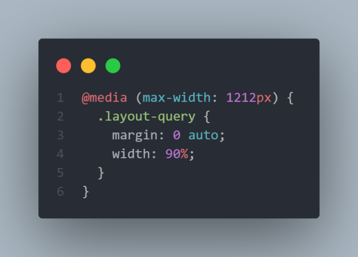

# mixins-sass
The project name is LESSIER that stands for less code to make projects easier :D.

Here I'll upload useful mixins for SASS (either created by me or others).

The images that I'll upload are illustrative only, they don't show all the properties you can use in the mixins (check out the SASS file to see all the properties that are available in the mixins). There are comments in the SASS file available for you to understand how to use each mixin.

## CSS Grid Mixin (14.07.21), created by [@said-alrove](https://twitter.com/said_alrove).

### Mixin's preview

#### SASS

#### CSS

## Flexbox Mixin (14.07.21), created by [@said-alrove](https://twitter.com/said_alrove).

### Mixin's preview

#### SASS

#### CSS

## Pseudo-elements mixin (15.07.21), created by [@said-alrove](https://twitter.com/said_alrove) but inspired in one made by [@kevinjpowell](https://twitter.com/kevinjpowell?lang=en).

### Mixin's preview

#### SASS

#### CSS

## Support mixin (15.07.21), created by [@said-alrove](https://twitter.com/said_alrove).

### Mixin's preview

#### SASS

#### CSS

## Shadow mixin (16.07.21), created by [@said-alrove](https://twitter.com/said_alrove).

### Mixin's preview

#### SASS

#### CSS

## Media Queries mixin (16.07.21), created by [@said-alrove](https://twitter.com/said_alrove).

### Mixin's preview

#### SASS

#### CSS

## Coming soon...
I'll continue uploading more mixins soon...if you want to help me adding more interesting mixins, send me a message on [Twitter](https://twitter.com/said_alrove) :D!.
